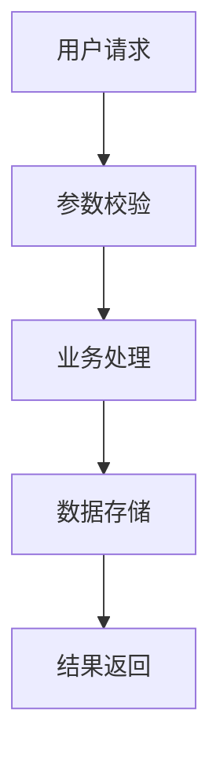
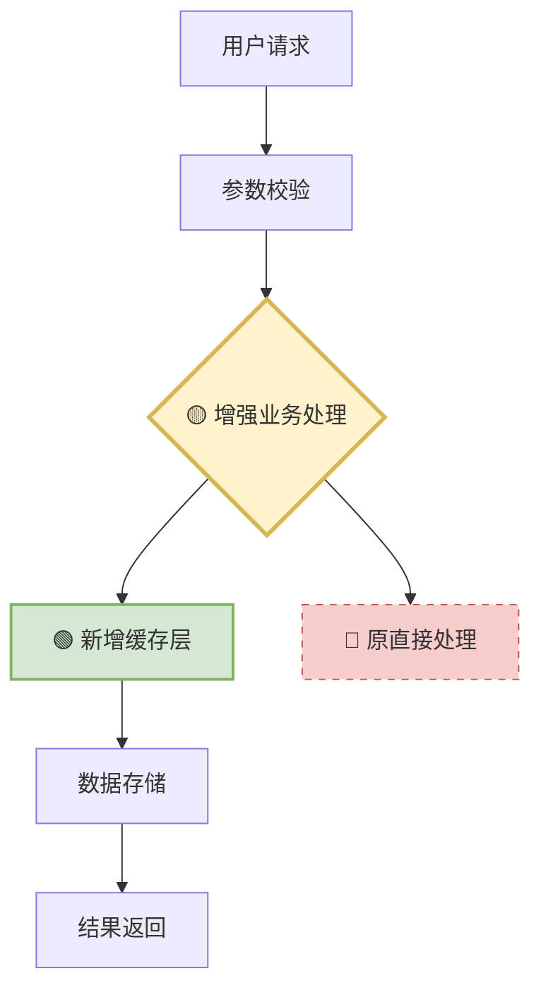
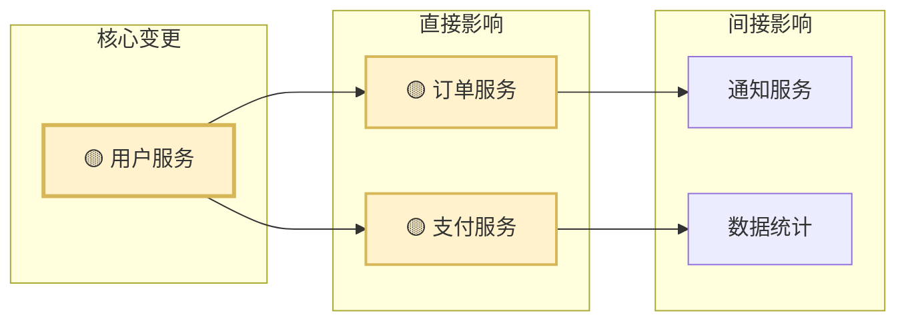

# 技术方案格式规范Rule
**必须基于当前仓库的实际情况进行分析**

## 规范说明
当AI需要输出技术方案文档时，必须严格按照以下格式进行组织，确保方案的完整性、可读性和实用性。

## 输出格式模板

### 1. 功能概述
简洁明了地描述要实现的功能或解决的问题：
- **功能目标**：核心功能和业务价值
- **适用场景**：具体的使用场景和业务上下文
- **改动范围概要**：明确说明需要修改哪些模块/类/文件（概述级别）

### 2. 信息补充需求（可选）
当基于用户提供的上下文和代码仓库信息无法独立完成方案设计时，才输出此章节。

**补充原则**：
- 仅提问在当前上下文和代码仓库中无法找到答案的关键信息
- 优先通过代码分析、MCP工具调用、文档搜索、依赖推理等方式自主获取信息
- 避免提问可以通过推理或常规设计模式解决的问题
- 聚焦影响方案核心设计的关键决策点

**需要补充的信息类型**：
- **业务规则澄清**：具体的业务逻辑和规则细节
- **非功能性需求**：具体的性能、安全、可用性指标要求
- **外部依赖信息**：第三方系统接口、数据格式、协议等
- **环境约束条件**：部署环境、资源限制、兼容性要求等
- **历史数据情况**：数据迁移策略、向后兼容性需求等

**提问格式要求**：
- 每个问题都要说明为什么无法从现有信息中获取
- 明确问题对方案设计的影响程度
- 提供可选的默认假设方案供用户选择

### 3. 技术关键点（可选）
仅当存在具体技术挑战时才输出此章节，避免输出泛泛而谈的内容：

**描述要求**：
- 具体说明技术难点和解决方案
- 提供量化指标（如性能目标、数据规模等）
- 说明技术选型的具体理由
- 避免"高可用"、"高性能"等空泛描述

### 4. 详细设计
#### 4.1 实现思路
下面每一部分都是可选的，仅当需要详细描述时才输出。
- **整体流程**：从输入到输出的完整处理流程
- **核心算法**：关键业务逻辑的处理方式
- **模块划分**：系统模块结构和职责分工
- **接口设计**：关键接口定义和交互方式

#### 4.2 架构图表
使用mermaid或UML图表展示，仅输出当前需求涉及到的图表：

**基础图表类型**：
- **系统架构图**：整体系统结构
- **流程图**：核心业务流程
- **时序图**：关键交互时序（特别是本需求涉及到的部分）
- **类图**：核心类结构关系（如适用）

**需求变更相关图表**（当存在需求变更时必须包含）：
- **变更对比图**：对比变更前后的架构/流程差异
- **变更影响图**：展示变更对系统各模块的影响范围
- **变更依赖图**：显示变更涉及的组件依赖关系

**图表中变更点标识规范**：
- 使用 🔴 标识删除的组件/流程
- 使用 🟢 标识新增的组件/流程
- 使用 🟡 标识修改的组件/流程
- 使用虚线边框表示即将废弃的组件
- 使用粗线边框表示核心变更组件
- 在技术方案中保留变更点标识，方便后续技术评审时进行技术评审

**示例1：基础流程图**


**示例2：包含变更点的流程图**


**示例3：变更影响图**


#### 4.3 存储方案（可选）
仅当存在存储方案设计时才输出此章节，避免输出泛泛而谈的内容：
- **数据模型**：核心实体和属性设计
- **存储选型**：数据库/缓存选择理由
- **索引策略**：查询优化和性能保障
- **数据一致性**：事务处理和数据同步

#### 4.4 关键代码示例（可选）
仅当属于通过关键代码进行说明的时候才输出次章节内容
仅展示核心逻辑的伪代码或关键方法签名：
```java
// 示例：核心处理方法签名
public Result processBusinessLogic(RequestParam param) {
    // 核心逻辑：参数校验 -> 业务处理 -> 结果封装
}
```

## 使用规则
1. **严格遵循章节结构**：
   - ✅ **允许**：根据实际需求省略不相关的章节（如某功能无需存储方案设计时可省略4.3章节）
   - ❌ **禁止**：在规定的章节结构之外自行添加任何新章节

2. **避免具体实现代码**：不输出完整的实现代码，仅提供关键逻辑示例

3. **图表清晰准确**：mermaid图表语法正确，逻辑清晰

4. **内容层次分明**：使用合适的标题层级和列表结构

5. **描述简洁准确**：避免冗长描述，突出关键信息

6. **技术方案可行**：确保方案在技术上可实现且合理

**重要提醒**：本规范的章节结构是经过精心设计的完整体系，任何自行添加的章节都可能破坏文档的标准化和一致性。如需补充内容，请在现有章节框架内进行组织。

## 输出示例引导
当用户要求技术方案时，请回复：
"我将按照技术方案格式规范为您提供结构化的技术方案，包含功能概述、技术关键点、详细设计和测试方案。"

## 输出内容
将技术方案按照上述格式进行组织输出到「技术方案名称」.md文件中。