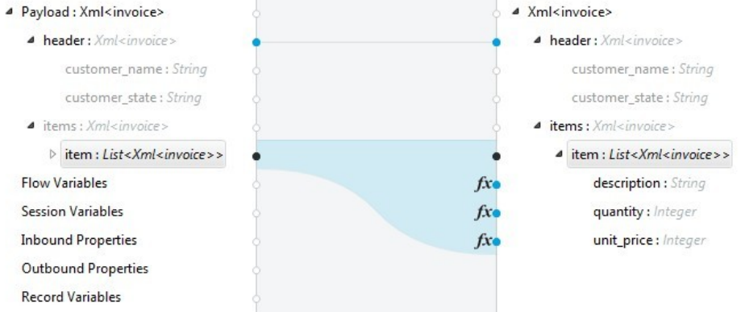

:toc:

= QLExpress

image::images/logo.png[]

【中文版】| link:README-EN.adoc[[English\]]

image::https://api.star-history.com/svg?repos=alibaba/QLExpress&type=Date[Star History Chart]

== 背景介绍

由阿里的电商业务规则演化而来的嵌入式Java动态脚本工具，在阿里集团有很强的影响力，同时为了自身不断优化、发扬开源贡献精神，于2012年开源。

在基本的表达式计算的基础上，还有以下特色：

* 灵活的自定义能力，通过 Java API 自定义函数和操作符，可以快速实现业务规则的 DSL
* 兼容最新的 Java 语法，方便 Java 程序员快速熟悉。熟悉类 C 语言的业务人员使用起来也会非常顺手
* 原生支持 JSON，快捷定义复杂数据结构
* 友好的报错提示，无论是编译还是运行时错误，都能精确友好地提示错误位置
* 独一无二的表达式追踪功能，可以追踪表达式在中间节点计算的值，方便业务人员或者 AI 对线上规则的计算结果进行归因分析
* 默认安全，脚本默认不允许和应用代码进行交互，如果需要交互，也可以自行定义安全的交互方式
* 解释执行，不占用 JVM 元空间，可以开启缓存提升解释性能
* 代码精简，依赖最小，适合所有java的运行环境

QLExpress4 作为 QLExpress 的最新演进版本，基于 Antlr4 重写了解析引擎，将原先的优点进一步发扬光大，新增了大量特色功能，彻底拥抱函数式编程，在性能和表达能力上都进行了进一步增强。

> 如果项目还是使用旧版本的 QLExpress，可以跳转 link:https://github.com/alibaba/QLExpress/tree/branch_version_3.x.x[branch_version_3.x.x] 维护分支查看旧版文档。如需升级可以参考 link:#附录一-升级指南[附录一-升级指南]

场景举例：

* 电商优惠券规则配置：通过 QLExpress 自定义函数和操作符快速实现优惠规则 DSL，供运营人员根据需求自行动态配置
* 表单搭建控件关联规则配置：表单搭建平台允许用户拖拽控件搭建自定义的表单，利用 QLExpress 脚本配置不同控件间的关联关系
* 流程引擎条件规则配置
* 广告系统计费规则配置

\...\...

== 新版特色

新版本并不是对旧版本的简单功能重构，而是我们基于对用户需求的洞察，对下一代规则表达式引擎的探索。拥有许多非常实用，但是在其他引擎中缺失的重要功能。

=== 表达式计算追踪

在业务人员完成规则脚本的配置后，很难对其线上执行情况进行感知。比如电商的促销规则，要求用户满足规则 `isVip && 未登录10天以上`。到底有多少线上用户是被 vip 条件拦截，又有多少用户是因为登录条件被拦截？这还是只是仅仅两个条件的简单规则，实际线上情况则更加复杂。

线上规则执行情况的追踪，不仅仅可以帮助业务人员了解线上的实际情况，排查和修复问题。其沉淀的数据也非常有价值，可以用于后续的规则优化和业务决策。以下是某个规则平台，基于 QLExpress4 的表达式追踪能力，对规则进行归因分析与附注的决策的产品简化图：

image::images/order_rules_cn.png[]

归因分析的原理在于利用 QLExpress4 的表达式追踪能力，获得表达式在计算过程中每个中间结果的值， 据此判断表达式最终运行结果产生的原因。

具体使用方法参考：link:#表达式计算追踪-1[表达式计算追踪]

=== 原生支持 JSON 语法

QLExpress4 原生支持 JSON 语法，可以快捷定义复杂的数据结构。

JSON 数组代表列表（List），而 JSON 对象代表映射（Map），也可以直接定义复杂对象。

产品上可以基于该特性实现 JSON 映射规则。让用户可以便捷地定义从一个模型向另一个模型的映射关系。以下是某个规则平台，基于该能力实现的模型映射产品简化图：

具体使用方法参考：link:#方便语法元素[方便语法元素]

=== 便捷字符串处理

QLExpress4 对字符串处理能力进行针对性的增强，在字符串中可以直接通过 `$\{expression}` 嵌入表达式计算结果。

具体使用方法参考：link:#动态字符串[动态字符串]

=== 附件透传

正常情况下，脚本执行需要的全部信息都在 `context` 中。context 中的 key 可以在脚本中作为变量引用，最终传递给自定义函数或者操作符。

但是出于安全，或者方便使用等因素考虑。有些信息并不希望用户通过变量引用到，比如租户名，密码等等。

此时可以通过附件（attachments）将这部分信息传递给自定义函数或者操作符使用。

具体使用方法参考：link:#添加自定义函数与操作符[添加自定义函数与操作符]  其中 `hello` 自定义函数根据附件中租户不同，返回不同的欢迎信息的示例。

=== 函数式编程

函数被提升为 QLExpress4 中的第一等公民，可以作为变量使用，也可以作为函数的返回值。并且可以很容易地和 Java 中常见的函数式 API（比如 Stream） 结合使用。

以下是一个简单的 QLExpress 示例脚本：

[source,java]
----
add = (a, b) -> {
  return a + b;
};
i = add(1,2);
assert(i == 3);
----

更多使用方法参考：

* link:#lambda-表达式[Lambda表达式]
* link:#列表过滤和映射[列表过滤和映射]
* link:#stream-api[Stream API]
* link:#函数式接口[函数式接口]

=== 分号简化

QLExpress4 支持省略分号，让表达式更加简洁。具体参考 link:#分号[分号]

== API 快速入门

=== 引入依赖

[source,xml]
----
<dependency>
    <groupId>com.alibaba</groupId>
    <artifactId>qlexpress4</artifactId>
    <version>4.0.7</version>
</dependency>
----

环境要求：

* JDK 8 或更高版本

=== 第一个 QLExpress 程序

[source,java,indent=0]
----
        Express4Runner express4Runner = new Express4Runner(InitOptions.DEFAULT_OPTIONS);
        Map<String, Object> context = new HashMap<>();
        context.put("a", 1);
        context.put("b", 2);
        context.put("c", 3);
        Object result = express4Runner.execute("a + b * c", context, QLOptions.DEFAULT_OPTIONS).getResult();
        assertEquals(7, result);
----

更多的表达式执行方式见文档 link:docs/execute.adoc[表达式执行]

=== 添加自定义函数与操作符

最简单的方式是通过 Java Lambda 表达式快速定义函数/操作符的逻辑：

[source,java,indent=0]
----
        Express4Runner express4Runner = new Express4Runner(InitOptions.DEFAULT_OPTIONS);
        // custom function
        express4Runner.addVarArgsFunction("join",
            params -> Arrays.stream(params).map(Object::toString).collect(Collectors.joining(",")));
        Object resultFunction =
            express4Runner.execute("join(1,2,3)", Collections.emptyMap(), QLOptions.DEFAULT_OPTIONS).getResult();
        assertEquals("1,2,3", resultFunction);
        
        // custom operator
        express4Runner.addOperatorBiFunction("join", (left, right) -> left + "," + right);
        Object resultOperator =
            express4Runner.execute("1 join 2 join 3", Collections.emptyMap(), QLOptions.DEFAULT_OPTIONS).getResult();
        assertEquals("1,2,3", resultOperator);
----

如果自定义函数的逻辑比较复杂，或者需要获得脚本的上下文信息，也可以通过继承 `CustomFunction` 的方式实现。

比如下面的 `hello` 自定义函数，根据租户不同，返回不同的欢迎信息：

[source,java,indent=0]
----
package com.alibaba.qlexpress4.test.function;

import com.alibaba.qlexpress4.runtime.Parameters;
import com.alibaba.qlexpress4.runtime.QContext;
import com.alibaba.qlexpress4.runtime.function.CustomFunction;

public class HelloFunction implements CustomFunction {
    @Override
    public Object call(QContext qContext, Parameters parameters)
        throws Throwable {
        String tenant = (String)qContext.attachment().get("tenant");
        return "hello," + tenant;
    }
}
----

[source,java,indent=0]
----
        Express4Runner express4Runner = new Express4Runner(InitOptions.DEFAULT_OPTIONS);
        express4Runner.addFunction("hello", new HelloFunction());
        String resultJack = (String)express4Runner.execute("hello()",
            Collections.emptyMap(),
            // Additional information(tenant for example) can be brought into the custom function from outside via attachments
            QLOptions.builder().attachments(Collections.singletonMap("tenant", "jack")).build()).getResult();
        assertEquals("hello,jack", resultJack);
        String resultLucy =
            (String)express4Runner
                .execute("hello()",
                    Collections.emptyMap(),
                    QLOptions.builder().attachments(Collections.singletonMap("tenant", "lucy")).build())
                .getResult();
        assertEquals("hello,lucy", resultLucy);
----

QLExpress4还支持通过QLExpress脚本添加自定义函数。需要注意的是，在函数外定义的变量（如示例中的defineTime）在函数定义时就已初始化完成，后续调用函数时不会重新计算该变量的值。

[source,java,indent=0]
----
        Express4Runner express4Runner =
            new Express4Runner(InitOptions.builder().securityStrategy(QLSecurityStrategy.open()).build());
        BatchAddFunctionResult addResult = express4Runner.addFunctionsDefinedInScript(
            "function myAdd(a,b) {\n" + "    return a+b;" + "}\n" + "\n" + "function getCurrentTime() {\n"
                + "    return System.currentTimeMillis();\n" + "}" + "\n" + "defineTime=System.currentTimeMillis();\n"
                + "function defineTime() {\n" + "    return defineTime;" + "}\n",
            ExpressContext.EMPTY_CONTEXT,
            QLOptions.DEFAULT_OPTIONS);
        assertEquals(3, addResult.getSucc().size());
        QLResult result = express4Runner.execute("myAdd(1,2)", Collections.emptyMap(), QLOptions.DEFAULT_OPTIONS);
        assertEquals(3, result.getResult());
        
        QLResult resultCurTime1 =
            express4Runner.execute("getCurrentTime()", Collections.emptyMap(), QLOptions.DEFAULT_OPTIONS);
        Thread.sleep(1000);
        QLResult resultCurTime2 =
            express4Runner.execute("getCurrentTime()", Collections.emptyMap(), QLOptions.DEFAULT_OPTIONS);
        assertNotSame(resultCurTime1.getResult(), resultCurTime2.getResult());
        
        /*
         * The defineTime variable is defined outside the function and is initialized when the function is defined;
         * it is not recalculated afterward, so the value returned is always the time at which the function was defined.
         */
        QLResult resultDefineTime1 =
            express4Runner.execute("defineTime()", Collections.emptyMap(), QLOptions.DEFAULT_OPTIONS);
        Thread.sleep(1000);
        QLResult resultDefineTime2 =
            express4Runner.execute("defineTime()", Collections.emptyMap(), QLOptions.DEFAULT_OPTIONS);
        assertSame(resultDefineTime1.getResult(), resultDefineTime2.getResult());
----

建议尽可能使用Java方式定义自定义函数，这样可以获得更好的性能和稳定性。

更多自定义语法元素的方式见文档 link:docs/custom-item.adoc[自定义语法元素]

=== 校验语法正确性

在不执行脚本的情况下，单纯校验语法的正确性，其中包含了操作符的限制校验，调用 `check` 并且捕获异常，如果捕获到 `QLSyntaxException`，则说明存在语法错误

[source,java,indent=0]
----
        Express4Runner express4Runner = new Express4Runner(InitOptions.DEFAULT_OPTIONS);
        try {
            express4Runner.check("a+b;\n(a+b");
            fail();
        }
        catch (QLSyntaxException e) {
            assertEquals(2, e.getLineNo());
            assertEquals(4, e.getColNo());
            assertEquals("SYNTAX_ERROR", e.getErrorCode());
            // <EOF> represents the end of script
            assertEquals(
                "[Error SYNTAX_ERROR: mismatched input '<EOF>' expecting ')']\n" + "[Near: a+b; (a+b<EOF>]\n"
                    + "                ^^^^^\n" + "[Line: 2, Column: 4]",
                e.getMessage());
        }
----

你可以使用 `CheckOptions` 配置更精细的语法校验规则，主要支持以下两个选项：

1. `operatorCheckStrategy`: 操作符校验策略，用于限制脚本中可以使用的操作符
2. `disableFunctionCalls`: 是否禁用函数调用，默认为 false

示例1：使用操作符校验策略（白名单）

[source,java,indent=0]
----
        // Create a whitelist of allowed operators
        Set<String> allowedOps = new HashSet<>(Arrays.asList("+", "*"));
        
        // Configure check options with operator whitelist
        CheckOptions checkOptions =
            CheckOptions.builder().operatorCheckStrategy(OperatorCheckStrategy.whitelist(allowedOps)).build();
        
        // Create runner and check script with custom options
        Express4Runner runner = new Express4Runner(InitOptions.DEFAULT_OPTIONS);
        runner.check("a + b * c", checkOptions); // This will pass as + and * are allowed
----

示例2：禁用函数调用

[source,java,indent=0]
----
        // Create a runner
        Express4Runner runner = new Express4Runner(InitOptions.DEFAULT_OPTIONS);
        
        // Create options with function calls disabled
        CheckOptions options = CheckOptions.builder().disableFunctionCalls(true).build();
        
        // Script with function call
        String scriptWithFunctionCall = "Math.max(1, 2)";
        
        // Use custom options to check script
        try {
            runner.check(scriptWithFunctionCall, options);
        }
        catch (QLSyntaxException e) {
            // Will throw exception as function calls are disabled
        }
----

=== 解析脚本所需外部变量

脚本中使用的变量有的是脚本内生，有的是需要从外部通过 `context` 传入的。

QLExpress4 提供了一个方法，可以解析出脚本中所有需要从外部传入的变量：

[source,java,indent=0]
----
        Express4Runner express4Runner = new Express4Runner(InitOptions.DEFAULT_OPTIONS);
        Set<String> outVarNames =
            express4Runner.getOutVarNames("int a = 1, b = 10;\n" + "c = 11\n" + "e = a + b + c + d\n" + "f+e");
        Set<String> expectSet = new HashSet<>();
        expectSet.add("d");
        expectSet.add("f");
        assertEquals(expectSet, outVarNames);
----

更多脚本依赖解析工具：

* `getOutFunctions`: 解析所有需要从外部定义的函数
* `getOutVarAttrs`：解析所有需要从外部传入变量及其涉及的属性，`getOutVarNames` 的增强版本

=== 高精度计算

QLExpress 内部会用 BigDecimal 表示所有无法用 double 精确表示数字，来尽可能地表示计算精度：

> 举例：0.1 在 double 中无法精确表示

[source,java,indent=0]
----
        Express4Runner express4Runner = new Express4Runner(InitOptions.DEFAULT_OPTIONS);
        Object result = express4Runner.execute("0.1", Collections.emptyMap(), QLOptions.DEFAULT_OPTIONS).getResult();
        assertTrue(result instanceof BigDecimal);
----

通过这种方式能够解决一些计算精度问题：

比如 0.1+0.2 因为精度问题，在 Java 中是不等于 0.3 的。
而 QLExpress 能够自动识别出 0.1 和 0.2 无法用双精度精确表示，改成用 BigDecimal 表示，确保其结果等于0.3

[source,java,indent=0]
----
        assertNotEquals(0.3, 0.1 + 0.2, 0.0);
        assertTrue((Boolean)express4Runner.execute("0.3==0.1+0.2", Collections.emptyMap(), QLOptions.DEFAULT_OPTIONS)
            .getResult());
----

除了默认的精度保证外，还提供了 `precise` 开关，打开后所有的计算都使用BigDecimal，防止外部传入的低精度数字导致的问题：

[source,java,indent=0]
----
        Map<String, Object> context = new HashMap<>();
        context.put("a", 0.1);
        context.put("b", 0.2);
        assertFalse((Boolean)express4Runner.execute("0.3==a+b", context, QLOptions.DEFAULT_OPTIONS).getResult());
        // open precise switch
        assertTrue((Boolean)express4Runner.execute("0.3==a+b", context, QLOptions.builder().precise(true).build())
            .getResult());
----

=== 安全策略

QLExpress4 默认采用隔离安全策略，不允许脚本访问 Java 对象的字段和方法，这确保了脚本执行的安全性。如果需要访问 Java 对象，可以通过不同的安全策略进行配置。

假设应用中有如下的 Java 类：

[source,java,indent=0]
----
package com.alibaba.qlexpress4.inport;

/**
 * Author: DQinYuan
 */
public class MyDesk {
    
    private String book1;
    
    private String book2;
    
    public String getBook1() {
        return book1;
    }
    
    public void setBook1(String book1) {
        this.book1 = book1;
    }
    
    public String getBook2() {
        return book2;
    }
    
    public void setBook2(String book2) {
        this.book2 = book2;
    }
}
----

脚本执行的上下文设置如下：

[source,java,indent=0]
----
        MyDesk desk = new MyDesk();
        desk.setBook1("Thinking in Java");
        desk.setBook2("Effective Java");
        Map<String, Object> context = Collections.singletonMap("desk", desk);
----

QLExpress4 提供了四种安全策略：

==== 1. 隔离策略（默认）

默认情况下，QLExpress4 采用隔离策略，不允许访问任何字段和方法：

[source,java,indent=0]
----
        // default isolation strategy, no field or method can be found
        Express4Runner express4RunnerIsolation = new Express4Runner(InitOptions.DEFAULT_OPTIONS);
        assertErrorCode(express4RunnerIsolation, context, "desk.book1", "FIELD_NOT_FOUND");
        assertErrorCode(express4RunnerIsolation, context, "desk.getBook2()", "METHOD_NOT_FOUND");
----

==== 2. 黑名单策略

通过黑名单策略，可以禁止访问特定的字段或方法，其他字段和方法可以正常访问：

[source,java,indent=0]
----
        // black list security strategy
        Set<Member> memberList = new HashSet<>();
        memberList.add(MyDesk.class.getMethod("getBook2"));
        Express4Runner express4RunnerBlackList = new Express4Runner(
            InitOptions.builder().securityStrategy(QLSecurityStrategy.blackList(memberList)).build());
        assertErrorCode(express4RunnerBlackList, context, "desk.book2", "FIELD_NOT_FOUND");
        Object resultBlack =
            express4RunnerBlackList.execute("desk.book1", context, QLOptions.DEFAULT_OPTIONS).getResult();
        Assert.assertEquals("Thinking in Java", resultBlack);
----

==== 3. 白名单策略

通过白名单策略，只允许访问指定的字段或方法，其他字段和方法都会被禁止：

[source,java,indent=0]
----
        // white list security strategy
        Express4Runner express4RunnerWhiteList = new Express4Runner(
            InitOptions.builder().securityStrategy(QLSecurityStrategy.whiteList(memberList)).build());
        Object resultWhite =
            express4RunnerWhiteList.execute("desk.getBook2()", context, QLOptions.DEFAULT_OPTIONS).getResult();
        Assert.assertEquals("Effective Java", resultWhite);
        assertErrorCode(express4RunnerWhiteList, context, "desk.getBook1()", "METHOD_NOT_FOUND");
----

==== 4. 开放策略

开放策略允许访问所有字段和方法，类似于 QLExpress3 的行为，但需要注意安全风险：

[source,java,indent=0]
----
        // open security strategy
        Express4Runner express4RunnerOpen =
            new Express4Runner(InitOptions.builder().securityStrategy(QLSecurityStrategy.open()).build());
        Assert.assertEquals("Thinking in Java",
            express4RunnerOpen.execute("desk.book1", context, QLOptions.DEFAULT_OPTIONS).getResult());
        Assert.assertEquals("Effective Java",
            express4RunnerOpen.execute("desk.getBook2()", context, QLOptions.DEFAULT_OPTIONS).getResult());
----

> 注意：开放策略虽然提供了最大的灵活性，但也带来了安全风险。建议只在受信任的环境中使用，不建议用于处理终端用户输入的脚本。

==== 策略建议

建议直接采用默认策略，在脚本中不要直接调用 Java 对象的字段和方法。而是通过自定义函数和操作符的方式（参考 link:#添加自定义函数与操作符[添加自定义函数与操作符]），对嵌入式脚本提供系统功能。这样能同时保证脚本的安全性和灵活性，用户体验还更好。

如果确实需要调用 Java 对象的字段和方法，至少应该使用白名单策略，只提供脚本有限的访问权限。

至于黑名单和开放策略，不建议在外部输入脚本的场景使用，除非确保每个脚本都会经过审核。

=== 调用应用中的 Java 类

> 需要放开安全策略，不建议用于终端用户输入

假设应用中有如下的 Java 类(`com.alibaba.qlexpress4.QLImportTester`)：

[source,java,indent=0]
----
package com.alibaba.qlexpress4;

public class QLImportTester {
    
    public static int add(int a, int b) {
        return a + b;
    }
    
}
----

在 QLExpress 中有如下两种调用方式。

==== 1. 在脚本中使用 `import` 语句导入类并且使用

[source,java,indent=0]
----
        Express4Runner express4Runner = new Express4Runner(InitOptions.builder()
            // open security strategy, which allows access to all Java classes within the application.
            .securityStrategy(QLSecurityStrategy.open())
            .build());
        // Import Java classes using the import statement.
        Map<String, Object> params = new HashMap<>();
        params.put("a", 1);
        params.put("b", 2);
        Object result =
            express4Runner
                .execute("import com.alibaba.qlexpress4.QLImportTester;" + "QLImportTester.add(a,b)",
                    params,
                    QLOptions.DEFAULT_OPTIONS)
                .getResult();
        Assert.assertEquals(3, result);
----

==== 2. 在创建 `Express4Runner` 时默认导入该类，此时脚本中就不需要额外的 `import` 语句

[source,java,indent=0]
----
        Express4Runner express4Runner = new Express4Runner(InitOptions.builder()
            .addDefaultImport(
                Collections.singletonList(ImportManager.importCls("com.alibaba.qlexpress4.QLImportTester")))
            .securityStrategy(QLSecurityStrategy.open())
            .build());
        Object result =
            express4Runner.execute("QLImportTester.add(1,2)", Collections.emptyMap(), QLOptions.DEFAULT_OPTIONS)
                .getResult();
        Assert.assertEquals(3, result);
----

除了用 `ImportManager.importCls` 导入单个类外，还有其他更方便的导入方式：

 * `ImportManager.importPack` 直接导入包路径下的所有类，比如 `ImportManager.importPack("java.util")` 会导入 `java.util` 包下的所有类，QLExpress 默认就会导入下面的包
 ** `ImportManager.importPack("java.lang")`
 ** `ImportManager.importPack("java.util")`
 ** `ImportManager.importPack("java.math")`
 ** `ImportManager.importPack("java.util.stream")`
 ** `ImportManager.importPack("java.util.function")`
 * `ImportManager.importInnerCls` 导入给定类路径里的所有内部类

=== 自定义 ClassLoader

QLExpress4 支持通过自定义 `ClassSupplier` 来指定类加载器，这在插件化架构、模块化应用等场景中非常有用。通过自定义类加载器，可以让 QLExpress 脚本访问特定 ClassLoader 中的类。

下面的示例展示了如何与 link:https://pf4j.org/[PF4J] 插件框架集成，让 QLExpress 脚本能够访问插件中的类：

[source,java,indent=0]
----
        // Specify plugin directory (test-plugins directory under test resources)
        Path pluginsDir = new File("src/test/resources/test-plugins").toPath();
        PluginManager pluginManager = new DefaultPluginManager(pluginsDir);
        pluginManager.loadPlugins();
        pluginManager.startPlugins();
        
        // Get the PluginClassLoader of the first plugin
        PluginWrapper plugin = pluginManager.getPlugins().get(0);
        ClassLoader pluginClassLoader = plugin.getPluginClassLoader();
        
        // Custom class supplier using plugin ClassLoader
        ClassSupplier pluginClassSupplier = clsName -> {
            try {
                return Class.forName(clsName, true, pluginClassLoader);
            }
            catch (ClassNotFoundException | NoClassDefFoundError e) {
                return null;
            }
        };
        
        InitOptions options = InitOptions.builder()
            .securityStrategy(QLSecurityStrategy.open())
            .classSupplier(pluginClassSupplier)
            .build();
        Express4Runner runner = new Express4Runner(options);
        
        String script = "import com.alibaba.qlexpress4.pf4j.TestPluginInterface; TestPluginInterface.TEST_CONSTANT";
        Object result = runner.execute(script, Collections.emptyMap(), QLOptions.DEFAULT_OPTIONS).getResult();
        
        Assert.assertEquals("Hello from PF4J Plugin!", result.toString());
----

自定义 ClassSupplier 的典型应用场景：

* **插件化架构**：让脚本能够访问插件中定义的类和接口
* **模块化应用**：在 OSGi 等模块化框架中，让脚本访问特定模块的类
* **动态类加载**：从远程仓库或动态生成的字节码中加载类
* **类隔离**：使用不同的 ClassLoader 来实现类的隔离

=== 表达式缓存

通过 `cache` 选项可以开启表达式缓存，这样相同的表达式就不会重新编译，能够大大提升性能。

注意该缓存没有限制大小，只适合在表达式为有限数量的情况下使用：

[source,java,indent=0]
----
        Express4Runner express4Runner = new Express4Runner(InitOptions.DEFAULT_OPTIONS);
        // open cache switch
        express4Runner.execute("1+2", new HashMap<>(), QLOptions.builder().cache(true).build());
----

但是当脚本首次执行时，因为没有缓存，依旧会比较慢。

可以通过下面的方法在首次执行前就将脚本缓存起来，保证首次执行的速度：

[source,java,indent=0]
----
        Express4Runner express4Runner = new Express4Runner(InitOptions.DEFAULT_OPTIONS);
        express4Runner.parseToDefinitionWithCache("a+b");
----

注意该缓存的大小是无限的，业务上注意控制大小，可以调用 `clearCompileCache` 方法定期清空编译缓存。

=== 清除 DFA 缓存

QLExpress 使用 ANTLR4 作为解析引擎，ANTLR4 在运行时会构建 DFA (确定有限状态自动机) 缓存来加速后续的语法解析。这个缓存会占用一定的内存空间。

在某些内存敏感的场景下，可以通过调用 `clearDFACache` 方法来清除 DFA 缓存，释放内存。

> **重要警告**: 清除 DFA 缓存会导致编译性能大幅下降，正常情况下不建议使用此方法。

==== 适用场景

* **内存敏感型应用**: 当内存使用是关键考虑因素，且可以容忍较慢的编译时间时
* **脚本不经常变更**: 当脚本相对稳定且不会频繁重新编译时

==== 最佳实践

在解析并缓存表达式后立即调用此方法，并确保后续所有执行都打开缓存选项以避免重新编译。示例代码如下：

[source,java,indent=0]
----
        /*
         * When the expression changes, parse it and add it to the expression cache;
         * after parsing is complete, call clearDFACache.
         */
        Express4Runner runner = new Express4Runner(InitOptions.DEFAULT_OPTIONS);
        runner.parseToDefinitionWithCache(exampleExpress);
        runner.clearDFACache();
        
        /*
         * All subsequent runs of this script must enable the cache option to ensure that re-compilation does not occur.
         */
        for (int i = 0; i < 3; i++) {
            runner.execute(exampleExpress, ExpressContext.EMPTY_CONTEXT, QLOptions.builder().cache(true).build());
        }
----

通过这种方式，可以在保证性能的同时，最大限度地降低内存占用。

=== 设置超时时间

可以给脚本设置一个超时时间，防止其中存在死循环或者其他原因导致应用资源被过量消耗。

下面的示例代码给脚本给脚本设置了一个 10ms 的超时时间：

[source,java,indent=0]
----
        Express4Runner express4Runner = new Express4Runner(InitOptions.DEFAULT_OPTIONS);
        try {
            express4Runner.execute("while (true) {\n" + "  1+1\n" + "}",
                Collections.emptyMap(),
                QLOptions.builder().timeoutMillis(10L).build());
            fail("should timeout");
        }
        catch (QLTimeoutException e) {
            assertEquals(QLErrorCodes.SCRIPT_TIME_OUT.name(), e.getErrorCode());
        }
----

> 注意，出于系统性能的考虑，QLExpress 对于超时时间的检测是不准确的。特别是在回调Java代码中（比如自定义函数或者操作符）出现的超时，不会立刻被检测到。只有在执行完，回到 QLExpress 运行时后才会被检测到并中断执行。

=== 扩展函数

利用 QLExpress 提供的扩展函数能力，可以给Java类中添加额外的成员方法。

扩展函数是基于 QLExpress 运行时实现的，因此仅仅在 QLExpress 脚本中有效。

下面的示例代码给 String 类添加了一个 `hello()` 扩展函数：

[source,java,indent=0]
----
        ExtensionFunction helloFunction = new ExtensionFunction() {
            @Override
            public Class<?>[] getParameterTypes() {
                return new Class[0];
            }
            
            @Override
            public String getName() {
                return "hello";
            }
            
            @Override
            public Class<?> getDeclaringClass() {
                return String.class;
            }
            
            @Override
            public Object invoke(Object obj, Object[] args) {
                String originStr = (String)obj;
                return "Hello," + originStr;
            }
        };
        Express4Runner express4Runner = new Express4Runner(InitOptions.DEFAULT_OPTIONS);
        express4Runner.addExtendFunction(helloFunction);
        Object result =
            express4Runner.execute("'jack'.hello()", Collections.emptyMap(), QLOptions.DEFAULT_OPTIONS).getResult();
        assertEquals("Hello,jack", result);
        
        // simpler way to define extension function
        express4Runner.addExtendFunction("add",
            Number.class,
            params -> ((Number)params[0]).intValue() + ((Number)params[1]).intValue());
        QLResult resultAdd = express4Runner.execute("1.add(2)", Collections.emptyMap(), QLOptions.DEFAULT_OPTIONS);
        assertEquals(3, resultAdd.getResult());
        
----

=== Java类的对象,字段和方法别名

QLExpress 支持通过 `QLAlias` 注解给对象，字段或者方法定义一个或多个别名，方便非技术人员使用表达式定义规则。

下面的例子中，根据用户是否 vip 计算订单最终金额。

用户类定义：

[source,java,indent=0]
----
package com.alibaba.qlexpress4.test.qlalias;

import com.alibaba.qlexpress4.annotation.QLAlias;

@QLAlias("用户")
public class User {
    
    @QLAlias("是vip")
    private boolean vip;
    
    @QLAlias("用户名")
    private String name;
    
    public boolean isVip() {
        return vip;
    }
    
    public void setVip(boolean vip) {
        this.vip = vip;
    }
    
    public String getName() {
        return name;
    }
    
    public void setName(String name) {
        this.name = name;
    }
}
----

订单类定义：

[source,java,indent=0]
----
package com.alibaba.qlexpress4.test.qlalias;

import com.alibaba.qlexpress4.annotation.QLAlias;

@QLAlias("订单")
public class Order {
    
    @QLAlias("订单号")
    private String orderNum;
    
    @QLAlias("金额")
    private int amount;
    
    public String getOrderNum() {
        return orderNum;
    }
    
    public void setOrderNum(String orderNum) {
        this.orderNum = orderNum;
    }
    
    public int getAmount() {
        return amount;
    }
    
    public void setAmount(int amount) {
        this.amount = amount;
    }
}
----

通过 QLExpress 脚本规则计算最终订单金额：

[source,java,indent=0]
----
        Order order = new Order();
        order.setOrderNum("OR123455");
        order.setAmount(100);
        
        User user = new User();
        user.setName("jack");
        user.setVip(true);
        
        // Calculate the Final Order Amount
        Express4Runner express4Runner =
            new Express4Runner(InitOptions.builder().securityStrategy(QLSecurityStrategy.open()).build());
        Number result = (Number)express4Runner
            .executeWithAliasObjects("用户.是vip? 订单.金额 * 0.8 : 订单.金额", QLOptions.DEFAULT_OPTIONS, order, user)
            .getResult();
        assertEquals(80, result.intValue());
----

=== 关键字，操作符和函数别名

为了进一步方面非技术人员编写规则，QLExpress 提供 `addAlias` 给原始关键字，操作符和函数增加别名。让整个脚本的表述更加贴近自然语言。

[source,java,indent=0]
----
        Express4Runner express4Runner = new Express4Runner(InitOptions.DEFAULT_OPTIONS);
        // add custom function zero
        express4Runner.addFunction("zero", (String ignore) -> 0);
        
        // keyword alias
        assertTrue(express4Runner.addAlias("如果", "if"));
        assertTrue(express4Runner.addAlias("则", "then"));
        assertTrue(express4Runner.addAlias("否则", "else"));
        assertTrue(express4Runner.addAlias("返回", "return"));
        // operator alias
        assertTrue(express4Runner.addAlias("大于", ">"));
        // function alias
        assertTrue(express4Runner.addAlias("零", "zero"));
        
        Map<String, Object> context = new HashMap<>();
        context.put("语文", 90);
        context.put("数学", 90);
        context.put("英语", 90);
        
        Object result = express4Runner
            .execute("如果 (语文 + 数学 + 英语 大于 270) 则 {返回 1;} 否则 {返回 零();}", context, QLOptions.DEFAULT_OPTIONS)
            .getResult();
        assertEquals(0, result);
----

支持设置别名的关键字有:

 * if
 * then
 * else
 * for
 * while
 * break
 * continue
 * return
 * function
 * macro
 * new
 * null
 * true
 * false

> 注意：部分大家熟悉的用法其实是操作符，而不是关键字，比如 `in` 操作符。而所有的操作符和函数默认就是支持别名的

=== 宏

宏是QLExpress中一个强大的代码复用机制，它允许用户定义一段可重用的脚本片段，并在需要时进行调用。与简单的文本替换不同，QLExpress的宏是基于指令回放的机制实现的，具有更好的性能和语义准确性。

宏特别适用于以下场景：

* **代码复用**：将常用的脚本片段封装成宏，避免重复编写相同的逻辑
* **业务规则模板**：定义标准的业务规则模板，如价格计算、权限检查等
* **流程控制**：封装复杂的控制流程，如条件判断、循环逻辑等
* **DSL构建**：作为构建领域特定语言的基础组件

宏可以通过两种方式定义：

**1. 在脚本中使用 `macro` 关键字定义**

[source,java]
----
macro add {
  c = a + b;
}

a = 1;
b = 2;
add;
assert(c == 3);
----

**2. 通过Java API添加**

[source,java,indent=0]
----
        Express4Runner express4Runner = new Express4Runner(InitOptions.DEFAULT_OPTIONS);
        express4Runner.addMacro("rename", "name='haha-'+name");
        Map<String, Object> context = Collections.singletonMap("name", "wuli");
        Object result = express4Runner.execute("rename", context, QLOptions.DEFAULT_OPTIONS).getResult();
        assertEquals("haha-wuli", result);
        
        // replace macro
        express4Runner.addOrReplaceMacro("rename", "name='huhu-'+name");
        Object result1 = express4Runner.execute("rename", context, QLOptions.DEFAULT_OPTIONS).getResult();
        assertEquals("huhu-wuli", result1);
----

宏与函数的区别：

[cols="1,1,1"]
|===
| 特性 | 宏 | 函数
| 参数传递 | 无参数，依赖上下文变量 | 支持参数传递
| 性能   | 指令直接插入，无调用开销 | 有函数调用开销
| 作用域    | 共享调用者作用域 | 独立的作用域
| 适用场景     | 代码片段复用 | 逻辑封装和参数化
|===

宏特别适合那些不需要参数传递、主要依赖上下文变量的代码片段复用场景，而函数更适合需要参数化和独立作用域的场景。

**QLExpress4 相比 3 版本，宏特性的变化**：

 * 4 的宏实现更加接近通常编程语言中宏的定义，相当于将预定义的代码片段插入到宏所在的位置，与调用点位于同一作用域，宏中的 `return`, `contine` 和 `break` 等可以影响调用方的控制流。但是 3 中的实现其实更加接近无参函数调用。
 * 4 的宏无法作为变量使用，只有单独作为一行语句时才能被宏替换。因为宏可以是任意脚本，不一定是有返回值的表达式，作为变量时会存在语义问题。3 的宏本质是一个无参函数调用，所以常常被作为变量使用

如果想兼容 3 中的宏特性，建议使用 link:#动态变量[动态变量]

=== 动态变量

常规的 “静态变量”，是 context 中和 key 关联的固定的值。而动态变量可以是一个表达式，由另外一些变量计算而得。动态变量支持嵌套，即动态变量可以依赖另一个动态变量计算得到。

示例如下：

[source,java,indent=0]
----
        Express4Runner express4Runner = new Express4Runner(InitOptions.DEFAULT_OPTIONS);
        
        Map<String, Object> staticContext = new HashMap<>();
        staticContext.put("语文", 88);
        staticContext.put("数学", 99);
        staticContext.put("英语", 95);
        
        QLOptions defaultOptions = QLOptions.DEFAULT_OPTIONS;
        DynamicVariableContext dynamicContext =
            new DynamicVariableContext(express4Runner, staticContext, defaultOptions);
        dynamicContext.put("平均成绩", "(语文+数学+英语)/3.0");
        dynamicContext.put("是否优秀", "平均成绩>90");
        
        // dynamic var
        assertTrue((Boolean)express4Runner.execute("是否优秀", dynamicContext, defaultOptions).getResult());
        assertEquals(94,
            ((Number)express4Runner.execute("平均成绩", dynamicContext, defaultOptions).getResult()).intValue());
        // static var
        assertEquals(187,
            ((Number)express4Runner.execute("语文+数学", dynamicContext, defaultOptions).getResult()).intValue());
----

=== 表达式计算追踪

如果打开相关选项，QLExpress4 就会在返回规则脚本计算结果的同时，返回一颗表达式追踪树。表达式追踪树的结构类似语法树，不同之处在于，它会在每个节点上记录本次执行的中间结果。

比如对于表达式 `!true || myTest(a, 1)`，表达式追踪树的结构大概如下：

[source]
----
        || true
       /      \
    ! false  myTest
    /        /   \
 true       a 10     1
----

可应用于多种场景：

 * 方便业务人员对规则的计算结果进行分析排查
 * 对线上判断为 false 的规则进行采样归类
 * AI 自动诊断和修复规则

节点计算结果会被放置到 `ExpressionTrace` 对象的 `value` 字段中。如果中间发生短路导致部分表达式未被计算，则 `ExpressionTrace` 对象的 `evaluated` 字段会被设置为 false。代码示例如下：

[source,java,indent=0]
----
        Express4Runner express4Runner = new Express4Runner(InitOptions.builder().traceExpression(true).build());
        express4Runner.addFunction("myTest", (Predicate<Integer>)i -> i > 10);
        
        Map<String, Object> context = new HashMap<>();
        context.put("a", true);
        QLResult result = express4Runner
            .execute("a && (!myTest(11) || false)", context, QLOptions.builder().traceExpression(true).build());
        Assert.assertFalse((Boolean)result.getResult());
        
        List<ExpressionTrace> expressionTraces = result.getExpressionTraces();
        Assert.assertEquals(1, expressionTraces.size());
        ExpressionTrace expressionTrace = expressionTraces.get(0);
        Assert.assertEquals("OPERATOR && false\n" + "  | VARIABLE a true\n" + "  | OPERATOR || false\n"
            + "      | OPERATOR ! false\n" + "          | FUNCTION myTest true\n" + "              | VALUE 11 11\n"
            + "      | VALUE false false\n", expressionTrace.toPrettyString(0));
        
        // short circuit
        context.put("a", false);
        QLResult resultShortCircuit = express4Runner.execute("(a && true) && (!myTest(11) || false)",
            context,
            QLOptions.builder().traceExpression(true).build());
        Assert.assertFalse((Boolean)resultShortCircuit.getResult());
        ExpressionTrace expressionTraceShortCircuit = resultShortCircuit.getExpressionTraces().get(0);
        Assert.assertEquals(
            "OPERATOR && false\n" + "  | OPERATOR && false\n" + "      | VARIABLE a false\n" + "      | VALUE true \n"
                + "  | OPERATOR || \n" + "      | OPERATOR ! \n" + "          | FUNCTION myTest \n"
                + "              | VALUE 11 \n" + "      | VALUE false \n",
            expressionTraceShortCircuit.toPrettyString(0));
        Assert.assertTrue(expressionTraceShortCircuit.getChildren().get(0).isEvaluated());
        Assert.assertFalse(expressionTraceShortCircuit.getChildren().get(1).isEvaluated());
        
        // in
        QLResult resultIn = express4Runner
            .execute("'ab' in ['cc', 'dd', 'ff']", context, QLOptions.builder().traceExpression(true).build());
        Assert.assertFalse((Boolean)resultIn.getResult());
        ExpressionTrace expressionTraceIn = resultIn.getExpressionTraces().get(0);
        Assert
            .assertEquals(
                "OPERATOR in false\n" + "  | VALUE 'ab' ab\n" + "  | LIST [ [cc, dd, ff]\n" + "      | VALUE 'cc' cc\n"
                    + "      | VALUE 'dd' dd\n" + "      | VALUE 'ff' ff\n",
                expressionTraceIn.toPrettyString(0));
----

> 注意，必须在新建 `Express4Runner` 时将 `InitOptions.traceExpression` 选项设置为 true，同时在执行脚本时将 `QLOptions.traceExpression` 设置为 true，该功能才能生效。

也可以在不执行脚本的情况下获得所有表达式追踪点：

[source,java,indent=0]
----
        Express4Runner express4Runner = new Express4Runner(InitOptions.DEFAULT_OPTIONS);
        TracePointTree tracePointTree = express4Runner.getExpressionTracePoints("1+3+5*ab+9").get(0);
        Assert.assertEquals("OPERATOR +\n" + "  | OPERATOR +\n" + "      | OPERATOR +\n" + "          | VALUE 1\n"
            + "          | VALUE 3\n" + "      | OPERATOR *\n" + "          | VALUE 5\n" + "          | VARIABLE ab\n"
            + "  | VALUE 9\n", tracePointTree.toPrettyString(0));
----

支持的表达式追踪点类型以及对应子节点的含义如下：

[cols="1,1,1"]
|===
| 节点类型 | 节点含义 | 子节点含义
| OPERATOR | 操作符 | 两侧操作数
| FUNCTION | 函数 | 函数参数
| METHOD   | 方法 | 方法参数
| FIELD    | 字段 | 取字段的目标对象
| LIST     | 列表 | 列表元素
| MAP      | 字段 | 无
| IF       | 条件分支 | condition表达式,then逻辑块和else逻辑块
| RETURN   | 返回语句 | 返回表达式
| VARIABLE | 变量 | 无
| VALUE    | 字面值   | 无
| DEFINE_FUNCTION | 定义函数 | 无
| DEFINE_MACRO | 定义宏 | 无
| PRIMARY  | 暂时未继续下钻的其他复合值（比如字典,if等等）| 无
| STATEMENT | 暂未继续下钻的其他复合语句（比如 while, for 等等）| 无
|===

=== 与 Spring 集成

QLExpress 并不需要专门与 Spring 集成，只需要一个 `Express4Runner` 单例，即可使用。

这里提供的 “集成” 示例，可以在 QLExpress 脚本中直接引用任意 Spring Bean。

这种方式虽然很方便，但是脚本权限过大，自由度太高。不再推荐使用，还是建议在 context 只放入允许用户访问的对象。

核心集成组件：

* link:src/test/java/com/alibaba/qlexpress4/spring/QLSpringContext.java[QLSpringContext]: 实现了 `ExpressContext` 接口，提供了对 Spring 容器的访问能力。它会优先从传入的 context 中查找变量，如果找不到则尝试从 Spring 容器中获取同名的 Bean。
* link:src/test/java/com/alibaba/qlexpress4/spring/QLExecuteService.java[QLExecuteService]: 封装了 QLExpress 的执行逻辑，集成了 Spring 容器，方便在 Spring 应用中使用。

假设存在一个 Spring Bean， 名为 `helloService`：

[source,java,indent=0]
----
package com.alibaba.qlexpress4.spring;

import org.springframework.stereotype.Service;

/**
 * Spring Bean example service class
 */
@Service
public class HelloService {
    
    /**
     * Hello method that returns a greeting string
     * @return greeting string
     */
    public String hello(String name) {
        return "Hello, " + name + "!";
    }
}
----

在脚本中调用该 Bean：

[source,java,indent=0]
----
package com.alibaba.qlexpress4.spring;

import org.junit.Assert;
import org.junit.Test;
import org.junit.runner.RunWith;
import org.springframework.beans.factory.annotation.Autowired;
import org.springframework.test.context.ContextConfiguration;
import org.springframework.test.context.junit4.SpringJUnit4ClassRunner;

import java.util.HashMap;
import java.util.Map;

/**
 * HelloService unit test class
 */
@RunWith(SpringJUnit4ClassRunner.class)
@ContextConfiguration(classes = SpringTestConfig.class)
public class SpringDemoTest {
    
    @Autowired
    private QLExecuteService qlExecuteService;
    
    @Test
    public void qlExecuteWithSpringContextTest() {
        Map<String, Object> context = new HashMap<>();
        context.put("name", "Wang");
        String result = (String)qlExecuteService.execute("helloService.hello(name)", context);
        Assert.assertEquals("Hello, Wang!", result);
    }
}
----

== 语法入门

QLExpress4 兼容 Java8 语法的同时，也提供了很多更加灵活宽松的语法模式，帮助用户更快捷地编写表达式。

基于表达式优先的语法设计，复杂的条件判断语句也可以直接当作表达式使用。

在本章节中出现的代码片段都是 qlexpress 脚本，
`assert` 是测试框架往引擎中注入的断言方法，会确保其参数为 `true`。
`assertErrCode` 会确保其 lambda 参数表达式的执行一定会抛出含第二个参数 error code 的 QLException。

=== 变量声明

同时支持静态类型和动态类型：

 * 变量声明时不写类型，则变量是动态类型，也同时是一个赋值表达式
 * 变量声明如果写类型，则是静态类型，此时是一个变量声明语句

[source,java]
----
// Dynamic Typeing
a = 1;
a = "1";
// Static Typing
int b = 2;
// throw QLException with error code INCOMPATIBLE_ASSIGNMENT_TYPE when assign with incompatible type String
assertErrorCode(() -> b = "1", "INCOMPATIBLE_ASSIGNMENT_TYPE")

----

=== 方便语法元素

列表(List)，映射(Map)等常用语法元素在 QLExpress 中都有非常方便的构造语法糖：

[source,java]
----
// list
l = [1,2,3]
assert(l[0]==1)
assert(l[-1]==3)
// Underlying data type of list is ArrayList in Java
assert(l instanceof ArrayList)
// map
m = {
  "aa": 10,
  "bb": {
    "cc": "cc1",
    "dd": "dd1"
  }
}
assert(m['aa']==10)
// Underlying data type of map is ArrayList in Java
assert(m instanceof LinkedHashMap)
// empty map
emMap = {:}
emMap['haha']='huhu'
assert(emMap['haha']=='huhu')
----

通过 `*.` 操作符，可以快捷地对列表和映射进行处理，比如对列表元素进行取属性，或者获得映射的 key 列表和 value 列表：

[source,java]
----
list = [
  {
    "name": "Li",
    "age": 10
  },
  {
    "name": "Wang",
    "age": 15
  }
]

// get field from list
assert(list*.age==[10,15])

mm = {
  "aaa": 1,
  "bbb": 2
}

// get map key value list
assert(mm*.key==["aaa", "bbb"])
assert(mm*.value==[1, 2])
----

在映射中通过 `@class` key 指定类型的全限定名，就可以直接使用 JSON 创建复杂Java对象。比如下面的 MyHome ， 是一个含有复杂嵌套类型 Java 类：

[source,java]
----
package com.alibaba.qlexpress4.inport;

/**
 * Author: DQinYuan
 */
public class MyHome {
    
    private String sofa;
    
    private String chair;
    
    private MyDesk myDesk;
    
    private String bed;
    
    public String getSofa() {
        return sofa;
    }
    
    public void setSofa(String sofa) {
        this.sofa = sofa;
    }
    
    public String getChair() {
        return chair;
    }
    
    public MyDesk getMyDesk() {
        return myDesk;
    }
    
    public void setMyDesk(MyDesk myDesk) {
        this.myDesk = myDesk;
    }
    
    public void setChair(String chair) {
        this.chair = chair;
    }
    
    public String getBed() {
        return bed;
    }
}
----

可以通过下面的 QLExpress 脚本，便捷创建：

> 注意，该特性需要参考 link:#安全策略[安全策略] 打开安全选项，才能正常执行。

[source,java]
----
myHome = {
  '@class': 'com.alibaba.qlexpress4.inport.MyHome',
  'sofa': 'a-sofa',
  'chair': 'b-chair',
  'myDesk': {
    'book1': 'Then Moon and Sixpence',
    '@class': 'com.alibaba.qlexpress4.inport.MyDesk'
  },
  // ignore field that don't exist
  'notexist': 1234
}
assert(myHome.getSofa()=='a-sofa')
assert(myHome instanceof com.alibaba.qlexpress4.inport.MyHome)
assert(myHome.getMyDesk().getBook1()=='Then Moon and Sixpence')
assert(myHome.getMyDesk() instanceof com.alibaba.qlexpress4.inport.MyDesk)
----

=== 数字

对于未声明类型的数字，
QLExpress会根据其所属范围自动从 int, long, BigInteger, double, BigDecimal 等数据类型中选择一个最合适的：

[source,java]
----
assert(2147483647 instanceof Integer);
assert(9223372036854775807 instanceof Long);
assert(18446744073709552000 instanceof BigInteger);
// 0.25 can be precisely presented with double
assert(0.25 instanceof Double);
assert(2.7976931348623157E308 instanceof BigDecimal);
----

因此在自定义函数或者操作符时，建议使用 Number 类型进行接收，因为数字类型是无法事先确定的。

=== 动态字符串

动态字符串是 QLExpress 为了增强字符串处理能力，在 4 版本新引入的能力。

支持 `$\{expression}` 的格式在字符串中插入表达式计算：

> 如果想在字符串中原样保持 `$\{expression}`，可以使用 `\$` 对 `$` 进行转义

[source,java]
----
a = 123
assert("hello,${a-1}" == "hello,122")

// escape $ with \$
assert("hello,\${a-1}" == "hello,\${a-1}")

b = "test"
assert("m xx ${
  if (b like 't%') {
      'YYY'
  }
}" == "m xx YYY")
----

如果还想让 QLExpress4 的字符串和 3 保持兼容性，不对插值表达式进行处理，可以在新建 `Express4Runner` 时直接关闭该特性：

[source,java]
----
        Express4Runner express4RunnerDisable = new Express4Runner(
            // disable string interpolation
            InitOptions.builder().interpolationMode(InterpolationMode.DISABLE).build());
        Assert.assertEquals("Hello,${ a + 1 }",
            express4RunnerDisable.execute("\"Hello,${ a + 1 }\"", context, QLOptions.DEFAULT_OPTIONS).getResult());
        Assert.assertEquals("Hello,${lll",
            express4RunnerDisable.execute("\"Hello,${lll\"", context, QLOptions.DEFAULT_OPTIONS).getResult());
        Assert.assertEquals("Hello,aaa $ lll\"\n\b",
            express4RunnerDisable.execute("\"Hello,aaa $ lll\\\"\n\b\"", context, QLOptions.DEFAULT_OPTIONS)
                .getResult());
----

=== 模板语言

利用动态字符串能力，QLExpress4 也可以作为一个轻量级模板引擎使用。

无需在脚本中手动添加字符串引号，直接调用 `executeTemplate` 渲染模板字符串：

[source,java,indent=0]
----
        Express4Runner express4Runner = new Express4Runner(InitOptions.DEFAULT_OPTIONS);
        Map<String, Object> context = new HashMap<>();
        context.put("a", 1);
        context.put("b", 2);
        context.put("c", "test");
        QLResult simpleTemplate = express4Runner.executeTemplate("a ${a};b ${b+2}", context, QLOptions.DEFAULT_OPTIONS);
        Assert.assertEquals("a 1;b 4", simpleTemplate.getResult());
        QLResult conditionTemplate =
            express4Runner.executeTemplate("m xx ${\n" + "  if (c like 't%') {\n" + "      'YYY'\n" + "  }\n" + "}",
                context,
                QLOptions.DEFAULT_OPTIONS);
        Assert.assertEquals("m xx YYY", conditionTemplate.getResult());
        QLResult multiLineTemplate = express4Runner.executeTemplate("m\n ${a}\n c", context, QLOptions.DEFAULT_OPTIONS);
        Assert.assertEquals("m\n 1\n c", multiLineTemplate.getResult());
        QLResult escapeStringTemplate =
            express4Runner.executeTemplate("m \n\"haha\" d\"", context, QLOptions.DEFAULT_OPTIONS);
        Assert.assertEquals("m \n\"haha\" d\"", escapeStringTemplate.getResult());
----

=== 占位符

占位符用于从 context 中提取任意 key 的值。

全局变量也可以从 context 中提取值，但是收到 QLExpress 关键词和语法的限制，能提取的 key 有限。
比如 context 中 "0" key 对应的值就无法通过变量提取，因为 0 不是 QLExpress 中的合法变量，而是一个数字常量。
此时可以用默认占位符 `$\{0}` 来提取。

> 注意和动态字符串中插值区分，占位符是写在字符串之外。动态字符串插值是 `$\{expression}`，其中默认写的是表达式，`"${0}"` 的运行结果是 `"0"`。而占位符是 `$\{placeholder}`，其中默认写的是 context 中的 key，`${0}` 的运行结果是 context 中 "0" key 对应的值。

QLExpress 默认使用 `$\{placeholder}` 格式的占位符，其中：

* `${` 是起始标记
* `}` 是结束标记
* `placeholder` 是占位符内容，对应 cotext 中的 key

除了默认的占位符外，QLExpress 还支持自定义占位符的起始和结束标记：

[source,java]
----
        Express4Runner express4Runner =
            new Express4Runner(InitOptions.builder().selectorStart("#[").selectorEnd("]").build());
        
        Map<String, Object> context = new HashMap<>();
        context.put("0", "World");
        
        QLResult result = express4Runner.execute("'Hello ' + #[0]", context, QLOptions.DEFAULT_OPTIONS);
        assertEquals("Hello World", result.getResult());
----

自定义占位符并不是任意的，限制条件如下：

* **起始标记限制**：`selectorStart` 必须是以下四种格式之一：
  ** `${` (默认)
  ** `$[`
  ** `#{`
  ** `#[`
* **结束标记限制**：`selectorEnd` 必须是 1 个或更多字符的字符串

=== 分号

表达式语句可以省略结尾的分号，整个脚本的返回值就是最后一个表达式的计算结果。

以下脚本的返回值为 2：

[source,java]
----
a = 1
b = 2
// last express
1+1
----

等价于以下写法：

[source,java]
----
a = 1
b = 2
// return statment
return 1+1;
----

因为分号可以省略，QLExpress4 对于换行的处理相比 3 或者 Java 语言更加严格。如果想要将多行表达式拆成多行，建议将操作符保留在当前行，而将右操作数换到下一行。

以下多行表达式会报语法错误（反例）：

[source,java]
----
// syntax error
a
+ b
----

以下是正确的换行示例（正例）：

[source,java]
----
a +
b
----

其他的语法习惯保持和 Java 一致即可。

=== 表达式

QLExpress 采用表达式优先的设计，其中 除了 import， return 和循环等结构外，几乎都是表达式。

if 语句也是一个表达式：

[source,java]
----
assert(if (11 == 11) {
  10
} else {
  20 + 2
} + 1 == 11)
----

try catch 结构也是一个表达式：

[source,java]
----
assert(1 + try {
    100 + 1/0
} catch(e) {
    // Throw a zero-division exception
    11
} == 12)
----

=== 短路计算

和 Java 类似，`&&` 和 `||` 逻辑运算都是短路运算的。

比如表达式 `false && (1/0)` 不会发生除 0 错误，因为 `&&` 短路在了最开始的 `false` 处。

短路计算默认是开启的，引擎也提供了选项，可以在某次执行时将短路关闭：

> 关闭短路的一个场景是保证表达式的充分预热

[source,java]
----
        Express4Runner express4Runner = new Express4Runner(InitOptions.DEFAULT_OPTIONS);
        // execute when enable short circuit (default)
        // `1/0` is short-circuited by the preceding `false`, so it won't throw an error.
        assertFalse((Boolean)express4Runner.execute("false && (1/0)", Collections.emptyMap(), QLOptions.DEFAULT_OPTIONS)
            .getResult());
        try {
            // execute when disable short circuit
            express4Runner.execute("false && (1/0)",
                Collections.emptyMap(),
                QLOptions.builder().shortCircuitDisable(true).build());
            fail();
        }
        catch (QLException e) {
            Assert.assertEquals("INVALID_ARITHMETIC", e.getErrorCode());
            Assert.assertEquals("Division by zero", e.getReason());
        }
----

=== 控制结构

==== if 分支

除了完全兼容 Java 中的 `if` 写法，还支持类似规则引擎的 `if ... then ... else ...` 的写法，其中 `then` 可以当成一个可以省略的关键字：

[source,java]
----
a = 11;
// if ... else ...
assert(if (a >= 0 && a < 5) {
  true
} else if (a >= 5 && a < 10) {
  false
} else if (a >= 10 && a < 15) {
  true
} == true)

// if ... then ... else ...
r = if (a == 11) then true else false
assert(r == true)
----

==== while 循环

[source,java]
----
i = 0;
while (i < 5) {
  if (++i == 2) {
    break;
  }
}
assert(i==2)
----

==== for 循环

[source,java]
----
l = [];
for (int i = 3; i < 6; i++) {
  l.add(i);
}
assert(l==[3,4,5])
----

==== for-each 循环

[source,java]
----
sum = 0;
for (i: [0,1,2,3,4]) {
  if (i == 2) {
    continue;
  }
  sum += i;
}
assert(sum==8)
----

==== try-catch

[source,java]
----
assert(try {
    100 + 1/0
} catch(e) {
    // Throw a zero-division exception
    11
} == 11)
----

=== 函数定义

[source,java]
----
function sub(a, b) {
    return a-b;
}
assert(sub(3,1)==2)
----

=== Lambda 表达式

QLExpress4 中，Lambda 表达式作为一等公民，可以作为变量进行传递或者返回。

[source,java]
----
add = (a, b) -> {
  return a + b;
}
assert(add(1,2)==3)
----

=== 列表过滤和映射

支持通过 filter, map 方法直接对列表类型进行函数式过滤和映射。

底层通过在列表类型添加 link:#扩展函数[扩展函数] 实现，注意和 Stream API 中同名方法区分。

相比 Stream Api，它可以直接对列表进行操作，返回值也直接就是列表，更加方便。

[source,java]
----
l = ["a-111", "a-222", "b-333", "c-888"]
assert(l.filter(i -> i.startsWith("a-"))
        .map(i -> i.split("-")[1]) == ["111", "222"])
----

=== 兼容 Java8 语法

QLExpress 可以兼容 Java8 的常见语法。

比如 link:#for-each-循环[for each循环], Stream API, 函数式接口等等。

==== Stream API

可以直接使用 Java 集合中的 stream api 对集合进行操作。

因为此时的 stream api 都是来自 Java 中的方法，参考 link:#安全策略[安全策略] 打开安全选项，以下脚本才能正常执行。

[source,java]
----
l = ["a-111", "a-222", "b-333", "c-888"]

l2 = l.stream()
      .filter(i -> i.startsWith("a-"))
      .map(i -> i.split("-")[1])
      .collect(Collectors.toList());
assert(l2 == ["111", "222"]);
----

==== 函数式接口

Java8 中引入了 Function, Consumer, Predicate 等函数式接口，QLExpress 中的 link:#lambda-表达式[Lambda表达式] 可以赋值给这些接口，或者作为接收这些接口的方法参数：

[source,java]
----
Runnable r = () -> a = 8;
r.run();
assert(a == 8);

Supplier s = () -> "test";
assert(s.get() == 'test');

Consumer c = (a) -> b = a + "-te";
c.accept("ccc");
assert(b == 'ccc-te');

Function f = a -> a + 3;
assert(f.apply(1) == 4);

Function f1 = (a, b) -> a + b;
assert(f1.apply("test-") == "test-null");
----

== 附录一 升级指南

QLExpress 的上一版本因为多年的迭代停滞，在各项特性上和业界产生了较大差距。

QLExpress4 的目标之一就是一次性弥补这些差距，因此选择进行了大刀阔斧的升级，而有意放弃了部分兼容性。当然，基础的功能和体验还是和上一版本保持了对齐。

如果系统已经使用老版本的 QLExpress，升级之前务必要进行一次全面的回归测试，确保这些脚本都能在新版中正常执行，再进行升级。

如果没有时间或者方法对它们一一验证，那么不建议进行升级。

如果是新系统，建议直接采用 QLExpress4，未来 QLExpress4 的生态建设会越来越完善，而 3 会被逐渐抛弃。

下面将列表新版和旧版的主要不同，方便用户对已有脚本进行升级。如有遗漏，欢迎反馈：

=== 默认安全策略

如果完全使用默认选项，获取 Java 对象的字段（`o.field`），或者调用成员方法（`o.method()`），则会分别抛出 `FIELD_NOT_FOUND` 和 `METHOD_NOT_FOUND` 错误。

这是因为 3 可以没有限制地通过反射访问 Java 应用系统中的任意字段和方法，这在嵌入式脚本中被认为是不安全的。

如果想兼容 3 的行为，则在新建 `Express4Runner` 时， 要将安全策略设置为 “开放”，参考代码如下：

[source,java,indent=0]
----
        // open security strategy
        Express4Runner express4RunnerOpen =
            new Express4Runner(InitOptions.builder().securityStrategy(QLSecurityStrategy.open()).build());
        Assert.assertEquals("Thinking in Java",
            express4RunnerOpen.execute("desk.book1", context, QLOptions.DEFAULT_OPTIONS).getResult());
        Assert.assertEquals("Effective Java",
            express4RunnerOpen.execute("desk.getBook2()", context, QLOptions.DEFAULT_OPTIONS).getResult());
----

详细参考 link:#安全策略[安全策略] 章节。

=== 定义映射

QLExpress 老版本支持通过 `NewMap(key:value)` 的方式快速创建映射，虽然在文档中没有详细讨论，但是很多用户通过单元测试和询问的方式，知晓并使用了这个语法。

不过这种语法过于定制，也和业界的规范相差很大，因此在新版中将其移除。

新版原生支持 JSON 语法，直接采用 JSON 字典的格式（`{key:value}`）即可快速创建映射，更加直观。

详细参考 link:#方便语法元素[方便语法元素]

=== 全局变量污染上下文

QLExpress 支持在执行脚本时传入一个全局的上下文，即 context 参数。

在老版本中，如果脚本中定义了全局变量，则这些变量也会写入到 context。在脚本执行结束后，可以通过 context 获取到脚本中定义的全局变量的值。

一个老版本的列子如下：

[source,java]
----
// only for QLExpress 3.x

String express = "a=3;a+1";
ExpressRunner runner = new ExpressRunner(false, true);
DefaultContext<String, Object> context = new DefaultContext<>();

Object res = runner.execute(express, context, null, true, true);
// The result of the script execution should be 4 (a+1)
Assert.assertEquals(4, res);
// The variable 'a' defined in the script is also stored in the context
Assert.assertEquals(3, context.get("a"));
----

根据调研和反馈，我们认为这会导致全局上下文被脚本 “污染”，存在安全性问题。

因此在 QLExpress4 中，全局变量默认不会写入到 context 中。

如果想要兼容 3 的特性，需要将 `polluteUserContext` 选项设置为 `true`，参考代码如下：

[source,java,indent=0]
----
        Express4Runner express4Runner = new Express4Runner(InitOptions.DEFAULT_OPTIONS);
        QLOptions populateOption = QLOptions.builder().polluteUserContext(true).build();
        Map<String, Object> populatedMap = new HashMap<>();
        populatedMap.put("b", 10);
        express4Runner.execute("a = 11;b = a", populatedMap, populateOption);
        assertEquals(11, populatedMap.get("a"));
        assertEquals(11, populatedMap.get("b"));
        
        // no population
        Map<String, Object> noPopulatedMap1 = new HashMap<>();
        express4Runner.execute("a = 11", noPopulatedMap1, QLOptions.DEFAULT_OPTIONS);
        assertFalse(noPopulatedMap1.containsKey("a"));
        
        Map<String, Object> noPopulatedMap2 = new HashMap<>();
        noPopulatedMap2.put("a", 10);
        assertEquals(19, express4Runner.execute("a = 19;a", noPopulatedMap2, QLOptions.DEFAULT_OPTIONS).getResult());
        assertEquals(10, noPopulatedMap2.get("a"));
----

=== 分号可省略

"分号可省略" 已经是现代脚本语言的一个标配，QLExpress4 也跟进了这个特性，分号是可以省略的。

具体参考 link:#分号[分号] 章节。

=== 严格换行模式

由于 QLExpress4 支持分号可省略，解释器需要通过换行符来判断语句是否结束。因此，QLExpress4 对换行的要求比 QLExpress3 更加严格。

下面的脚本在 QLExpress3 中是合法的，但在 QLExpress4 中不是：

[source,java]
----
// 在 QLExpress3 中合法的脚本，但在 QLExpress4 中不是
商家应收=
    价格
   - 饭卡商家承担
   + 平台补贴
----

在 QLExpress4 中，上述脚本会被解析为两个独立的语句：
1. `商家应收 = 价格`
2. `- 饭卡商家承担 + 平台补贴`（第二个语句会报语法错误）

如果要在 QLExpress4 中实现同样的效果，需要将操作符放在行尾，而不是行首：

[source,java]
----
// QLExpress4 中正确的写法
商家应收=
    价格 -
    饭卡商家承担 +
    平台补贴
----

这样解释器就知道当前行的表达式还未结束，会继续读取下一行。

如果您需要兼容 QLExpress3 的换行特性，可以设置 `strictNewLines` 选项为 `false`：

[source,java]
----
        Express4Runner express4Runner = new Express4Runner(InitOptions.builder().strictNewLines(false).build());
        String script = "商家应收=\n    价格\n   - 饭卡商家承担\n   + 平台补贴";
        Map<String, Object> context = new HashMap<>();
        context.put("价格", 10);
        context.put("饭卡商家承担", 3);
        context.put("平台补贴", 5);
        QLResult result = express4Runner.execute(script, context, QLOptions.DEFAULT_OPTIONS);
        Assert.assertEquals(12, ((Number)result.getResult()).intValue());
----

注意：非严格换行模式会让解释器忽略所有换行符，可能会影响代码的可读性和错误提示的准确性。建议仅在需要兼容旧代码时使用。

=== 获得 char 类型

在 QLExpress 3 中，单引号包裹的单个字符会被解析为 char 类型，而不是 String。

这个给用户带来了不少困惑，比如 `"a"=='a'` 的判断结果是 `false`。

所以后来 QLExpress 3 中新增了 `ExpressRunner.setIgnoreConstChar` 选项，设置为 `true` 后，所有的单引号和双引号包裹的字符都会被解析为 String 类型。但是这个选项默认是关闭的，需要用户手动开启。

考虑到脚本用户很少会使用到 `char` 这种底层类型，我们在 QLExpress 4 中直接取消了这个选项，所有的单引号和双引号包裹的字符都会被解析为 String 类型。

如果您在脚本还是需要使用 `char` 类型，可以通过两种方法获得：

* 类型强转：`(char) 'a'`
* 类型声明：`char a = 'a'`

== 附录二 如何贡献？

QLExpress 对社区的更改完全开放，任何建议和修改，都会受到欢迎，讨论后合理最后会被接纳到主干中。

首先需要将代码 clone 到本地，在正式修改代码前，需要先进行如下准备：

1. 项目根目录执行 `mvn compile`：项目刚刚下载到本地时，会有大量的类找不到，需要先生成 Antlr4 的运行时代码
2. 配置代码格式化：QLExpress 项目有统一的代码格式规范，开发前需要配置在 git 提交前的自动格式化

在项目目录下新建文件 `.git/hooks/pre-commit`，内容如下：

[source,bash]
----
#!/bin/sh
mvn spotless:apply
git add -u
exit 0
----

这样在每次 git commit 之前，就会自动执行 maven 的 spotless 插件执行代码格式化，具体代码格式配置见 link:spotless_eclipse_formatter.xml[]

3. 执行单元测试：在开发完成代码之后，先在本地全量执行单元测试，确保代码质量
   - JDK 8 环境：执行 `mvn test`
   - JDK 9 及以上环境：执行 `mvn test -DargLine="--add-opens java.base/java.util.stream=ALL-UNNAMED --add-opens java.base/java.util=ALL-UNNAMED"`

== 附录三 QLExpress4性能提升

link:https://www.yuque.com/xuanheng-ffjti/iunlps/pgfzw46zel2xfnie?singleDoc#%20%E3%80%8AQLExpress3%E4%B8%8E4%E6%80%A7%E8%83%BD%E5%AF%B9%E6%AF%94%E3%80%8B[QLExpress4与3性能对比]

总结：常见场景下，无编译缓存时，QLExpress4能比3有接近10倍性能提升；有编译缓存，也有一倍性能提升。

== 附录四 开发者联系方式

 * Email:
 ** qinyuan.dqy@alibaba-inc.com
 ** yumin.pym@taobao.com
 ** 704643716@qq.com
 * WeChat:
 ** xuanheng: dqy932087612
 ** binggou: pymbupt
 ** linxiang: tkk33362
 * DingTalk Support Group

image::images/qlexpress_support_group_qr_2026.jpg[]
