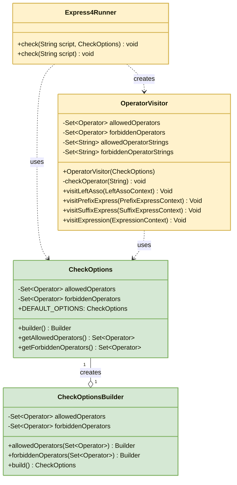
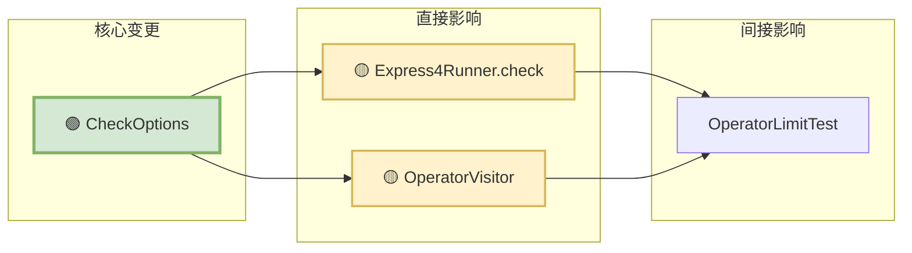

# 运算符限制配置重构技术方案

## 1. 功能概述

### 功能目标
将运算符黑白名单配置从 `InitOptions` 中分离出来,创建独立的 `CheckOptions` 配置类,实现配置职责的清晰分离。

### 适用场景
- 需要对脚本中使用的运算符进行限制的场景
- 需要在不同场景下使用不同运算符限制策略的场景
- 需要在运行时动态调整运算符限制的场景

### 改动范围概要
- 🟢 新增 `CheckOptions` 类
- 🟡 修改 `Express4Runner.check()` 方法
- 🟡 修改 `OperatorVisitor` 构造函数
- 🟡 更新测试用例 `OperatorLimitTest`

## 2. 技术关键点

### 职责分离
- **InitOptions**: 负责 Express4Runner 的全局初始化配置(类加载、安全策略、调试模式等)
- **CheckOptions**: 专门负责脚本校验时的运算符限制配置(白名单/黑名单)

### 向后兼容
- 保留 `Express4Runner.check(String script)` 无参版本,使用默认配置
- 新增 `Express4Runner.check(String script, CheckOptions checkOptions)` 重载方法

## 3. 详细设计

### 3.1 实现思路

#### 整体流程
1. 用户创建 `CheckOptions` 配置对象,设置运算符白名单或黑名单
2. 调用 `Express4Runner.check(script, checkOptions)` 进行脚本校验
3. `check` 方法内部创建 `OperatorVisitor`,传入 `CheckOptions`
4. `OperatorVisitor` 遍历语法树,校验每个运算符是否符合限制规则
5. 如果发现违规运算符,立即抛出 `QLSyntaxException`

#### 模块划分
- **CheckOptions**: 配置类,封装运算符限制规则
- **Express4Runner**: 入口类,提供 check 方法
- **OperatorVisitor**: 校验器,执行实际的运算符校验逻辑

### 3.2 架构图表

#### 类图



#### 变更对比流程图


#### 变更影响图



### 3.3 关键代码示例

#### CheckOptions 类设计

```java
public class CheckOptions {
    private final Set<Operator> allowedOperators;
    private final Set<Operator> forbiddenOperators;

    public static final CheckOptions DEFAULT_OPTIONS = new CheckOptions(null, null);

    private CheckOptions(Set<Operator> allowedOperators, Set<Operator> forbiddenOperators) {
        // 校验:白名单和黑名单不能同时设置
        if (allowedOperators != null && !allowedOperators.isEmpty()
            && forbiddenOperators != null && !forbiddenOperators.isEmpty()) {
            throw new IllegalArgumentException("不能同时设置白名单和黑名单");
        }

        this.allowedOperators = allowedOperators != null ?
            Collections.unmodifiableSet(allowedOperators) : null;
        this.forbiddenOperators = forbiddenOperators != null ?
            Collections.unmodifiableSet(forbiddenOperators) : null;
    }

    public static Builder builder() {
        return new Builder();
    }

    public static class Builder {
        private Set<Operator> allowedOperators;
        private Set<Operator> forbiddenOperators;

        public Builder allowedOperators(Set<Operator> allowedOperators) {
            this.allowedOperators = allowedOperators;
            return this;
        }

        public Builder forbiddenOperators(Set<Operator> forbiddenOperators) {
            this.forbiddenOperators = forbiddenOperators;
            return this;
        }

        public CheckOptions build() {
            return new CheckOptions(allowedOperators, forbiddenOperators);
        }
    }
}
```

#### Express4Runner.check 方法签名

```java
// 新增:接收 CheckOptions 参数
public void check(String script, CheckOptions checkOptions) throws QLSyntaxException {
    QLParser.ProgramContext programContext = parseToSyntaxTree(script);
    OperatorVisitor operatorVisitor = new OperatorVisitor(checkOptions);
    programContext.accept(operatorVisitor);
}

// 保留:向后兼容
public void check(String script) throws QLSyntaxException {
    check(script, CheckOptions.DEFAULT_OPTIONS);
}
```

#### OperatorVisitor 构造函数

```java
public OperatorVisitor(CheckOptions checkOptions) {
    if (checkOptions == null) {
        checkOptions = CheckOptions.DEFAULT_OPTIONS;
    }

    this.allowedOperators = checkOptions.getAllowedOperators();
    this.forbiddenOperators = checkOptions.getForbiddenOperators();

    // 转换为字符串集合用于快速查找
    this.allowedOperatorStrings = (allowedOperators != null && !allowedOperators.isEmpty()) ?
        allowedOperators.stream()
            .map(Operator::getOperator)
            .collect(Collectors.toSet()) : null;

    this.forbiddenOperatorStrings = (forbiddenOperators != null && !forbiddenOperators.isEmpty()) ?
        forbiddenOperators.stream()
            .map(Operator::getOperator)
            .collect(Collectors.toSet()) : null;
}
```

## 4. 使用示例

### 白名单模式

```java
// 创建白名单配置
Set<Operator> allowedOps = new HashSet<>(Arrays.asList(
    PlusOperator.getInstance(),
    MultiplyOperator.getInstance()
));

CheckOptions checkOptions = CheckOptions.builder()
    .allowedOperators(allowedOps)
    .build();

// 使用配置进行校验
Express4Runner runner = new Express4Runner(InitOptions.DEFAULT_OPTIONS);
runner.check("a + b * c", checkOptions);  // ✅ 通过
runner.check("a = b + c", checkOptions);  // ❌ 抛出异常:使用了不允许的运算符 =
```

### 黑名单模式

```java
// 创建黑名单配置
Set<Operator> forbiddenOps = new HashSet<>(Arrays.asList(
    AssignOperator.getInstance()
));

CheckOptions checkOptions = CheckOptions.builder()
    .forbiddenOperators(forbiddenOps)
    .build();

// 使用配置进行校验
Express4Runner runner = new Express4Runner(InitOptions.DEFAULT_OPTIONS);
runner.check("a + b * c", checkOptions);  // ✅ 通过
runner.check("a = b + c", checkOptions);  // ❌ 抛出异常:使用了被禁止的运算符 =
```

### 无限制模式

```java
// 不传入 CheckOptions 或使用默认配置
Express4Runner runner = new Express4Runner(InitOptions.DEFAULT_OPTIONS);
runner.check("a = b + c");  // ✅ 通过,不进行任何限制
```

## 5. 测试验证

### 测试用例覆盖

| 测试用例 | 描述 | 状态 |
|---------|------|------|
| testCheckWithAllowedOperators | 白名单模式 - 允许的运算符可以正常使用 | ✅ 通过 |
| testCheckWithDisallowedOperators | 白名单模式 - 使用不允许的运算符会抛出异常 | ✅ 通过 |
| testCheckWithForbiddenOperators | 黑名单模式 - 不在黑名单中的运算符可以正常使用 | ✅ 通过 |
| testCheckWithForbiddenOperatorUsed | 黑名单模式 - 使用被禁止的运算符会抛出异常 | ✅ 通过 |
| testCheckWithoutLimit | 无限制模式 - 任何运算符都可以使用 | ✅ 通过 |
| testCannotSetBothWhitelistAndBlacklist | 白名单和黑名单不能同时设置 | ✅ 通过 |

### 测试结果

```
Tests run: 6, Failures: 0, Errors: 0, Skipped: 0
```

## 6. 优势与收益

### 职责分离
- `InitOptions`: 专注于 Express4Runner 的全局初始化配置
- `CheckOptions`: 专注于脚本校验时的运算符限制配置
- 符合单一职责原则(SRP)

### 灵活性提升
- 可以在不同的 check 调用中使用不同的运算符限制策略
- 无需重新创建 Express4Runner 实例即可切换限制规则

### 向后兼容
- 保留了 `check(String script)` 无参版本
- 现有代码无需修改即可继续使用

### 代码清晰度
- 配置意图更加明确:CheckOptions 专门用于校验配置
- 降低了 InitOptions 的复杂度

## 7. 注意事项

1. **白名单和黑名单互斥**: 不能同时设置,否则会抛出 `IllegalArgumentException`
2. **默认行为**: 如果不传入 CheckOptions 或使用 `DEFAULT_OPTIONS`,则不进行任何运算符限制
3. **不可变性**: CheckOptions 中的集合是不可变的,保证线程安全
4. **性能考虑**: 运算符字符串集合在构造时预先转换,避免运行时重复转换

## 8. 后续优化建议

1. **预定义配置**: 可以提供一些常用的预定义配置,如 `CheckOptions.SAFE_MODE`(只允许安全运算符)
2. **配置组合**: 支持多个 CheckOptions 的组合,实现更灵活的限制策略
3. **运算符分组**: 提供运算符分组功能,如 `ARITHMETIC_OPS`、`LOGIC_OPS` 等,简化配置
